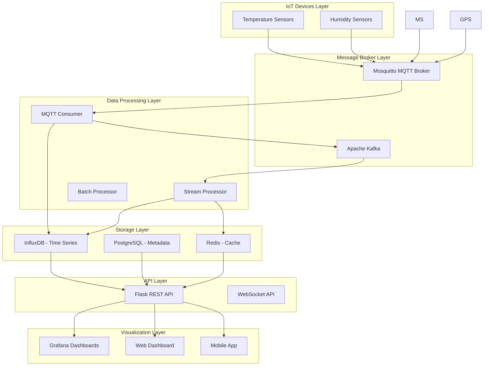
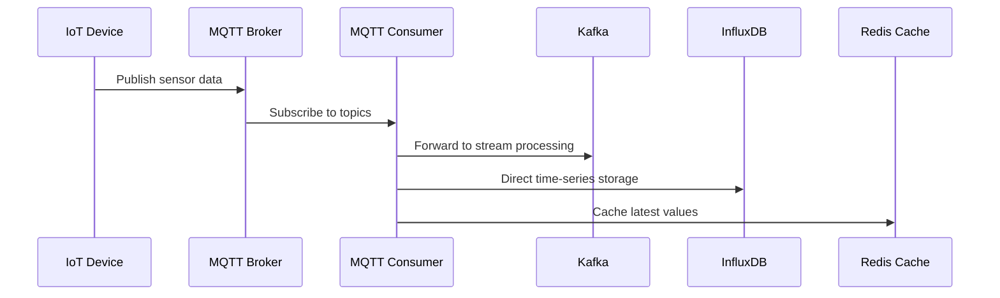
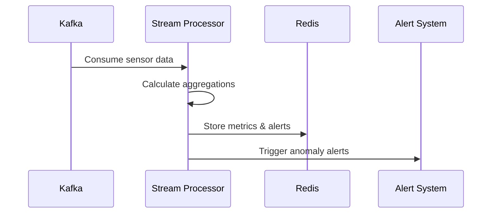
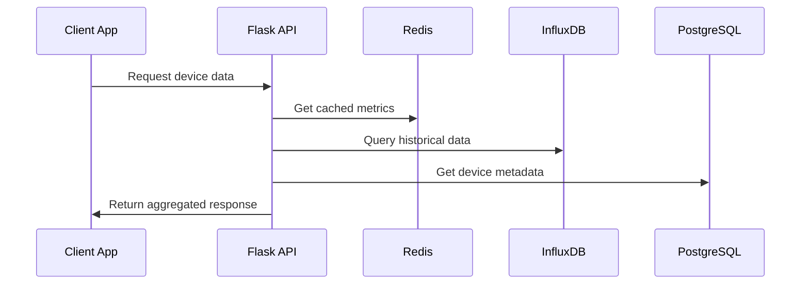
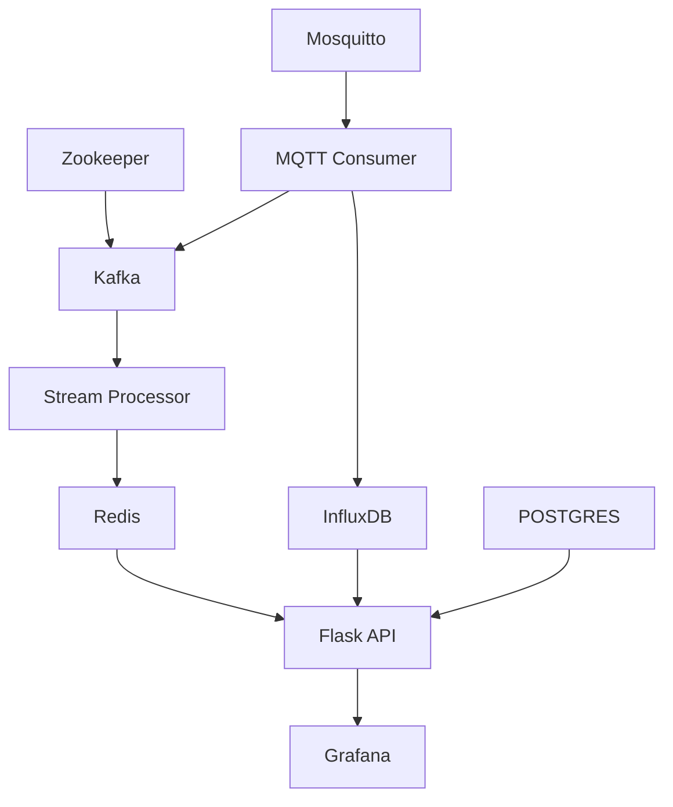

# IoT Data Engineering Architecture Design

## Table of Contents
1. [System Overview](#system-overview)
2. [Architecture Components](#architecture-components)
3. [Data Flow Architecture](#data-flow-architecture)
4. [Technology Stack](#technology-stack)
5. [Component Design](#component-design)
6. [Database Design](#database-design)
7. [API Design](#api-design)
8. [Deployment Architecture](#deployment-architecture)
9. [Security Architecture](#security-architecture)
10. [Monitoring & Observability](#monitoring--observability)

## System Overview

The IoT Data Engineering platform is designed to handle real-time sensor data collection, processing, storage, and visualization. The system supports multiple sensor types with scalable data ingestion, stream processing, and analytics capabilities.

### Key Features
- **Real-time Data Ingestion**: MQTT-based sensor data collection
- **Stream Processing**: Real-time analytics and anomaly detection
- **Time-series Storage**: Optimized for sensor data patterns
- **RESTful API**: Easy integration and data access
- **Interactive Dashboards**: Real-time monitoring and visualization
- **Alert Management**: Automated anomaly detection and notifications

## Architecture Components



## Data Flow Architecture

### 1. Data Ingestion Flow



### 2. Stream Processing Flow



### 3. API Access Flow



## Technology Stack

### Core Technologies
| Component | Technology | Version | Purpose |
|-----------|------------|---------|---------|
| **Message Broker** | Eclipse Mosquitto | 2.0 | MQTT communication |
| **Stream Platform** | Apache Kafka | 7.4.0 | Event streaming |
| **Time-series DB** | InfluxDB | 2.7 | Sensor data storage |
| **Relational DB** | PostgreSQL | 15 | Metadata storage |
| **Cache** | Redis | 7-alpine | Real-time caching |
| **API Framework** | Flask | 2.3.3 | REST API services |
| **Visualization** | Grafana | 10.0.0 | Dashboards |
| **Containerization** | Docker | Latest | Service orchestration |

### Development Stack
| Category | Technologies |
|----------|-------------|
| **Languages** | Python 3.8+, SQL |
| **Data Processing** | Pandas, NumPy |
| **MQTT Client** | Paho MQTT |
| **Kafka Client** | kafka-python |
| **Database Clients** | influxdb-client, psycopg2 |
| **Web Framework** | Flask, Flask-CORS |

## Component Design

### 1. IoT Device Simulators

```python
# Component Architecture
class SensorSimulator:
    - device_id: UUID
    - location: String
    - mqtt_client: MQTTClient
    - base_value: Float
    
    + generate_reading(): Dict
    + start_publishing(interval): None
    + simulate_realistic_data(): Float
```

**Key Features:**
- Realistic data simulation with noise and patterns
- Configurable publishing intervals
- Device metadata (battery, signal strength)
- Multiple sensor types support

### 2. Data Ingestion Layer

```python
# MQTT to Kafka Bridge
class MQTTToKafkaBridge:
    - mqtt_client: MQTTClient
    - kafka_producer: KafkaProducer
    - influx_client: InfluxDBClient
    
    + on_mqtt_message(topic, payload): None
    + forward_to_kafka(data): None
    + write_to_influxdb(data): None
```

**Responsibilities:**
- Subscribe to MQTT sensor topics
- Route messages to Kafka for stream processing
- Direct write to InfluxDB for storage
- Error handling and logging

### 3. Stream Processing Engine

```python
# Real-time Stream Processor
class StreamProcessor:
    - kafka_consumer: KafkaConsumer
    - redis_client: RedisClient
    - device_windows: Dict[deque]
    
    + process_temperature_data(data): None
    + process_humidity_data(data): None
    + calculate_health_score(data): Float
    + detect_anomalies(data): List[Alert]
```

**Processing Capabilities:**
- Sliding window aggregations
- Moving averages calculation
- Anomaly detection algorithms
- Device health scoring
- Real-time alerting

### 4. API Layer Design

```python
# REST API Endpoints
@app.route('/api/devices')              # GET: List all devices
@app.route('/api/device/<id>/latest')   # GET: Latest readings
@app.route('/api/device/<id>/history')  # GET: Historical data
@app.route('/api/alerts')               # GET: Recent alerts
@app.route('/api/dashboard/stats')      # GET: Dashboard metrics
```

## Database Design

### 1. InfluxDB Schema (Time-series Data)

```sql
-- Measurement: temperature_sensor
temperature_sensor,device_id=<uuid>,location=<location> 
    temperature_celsius=<float>,
    temperature_fahrenheit=<float>,
    meta_battery_level=<int>,
    meta_signal_strength=<int> 
    <timestamp>

-- Measurement: humidity_sensor  
humidity_sensor,device_id=<uuid>,location=<location>
    humidity_percent=<float>,
    dew_point=<float>,
    meta_battery_level=<int>,
    meta_signal_strength=<int>
    <timestamp>
```

### 2. PostgreSQL Schema (Metadata)

```sql
-- Device Registry
CREATE TABLE devices (
    device_id UUID PRIMARY KEY,
    device_type VARCHAR(50) NOT NULL,
    location VARCHAR(100),
    installation_date TIMESTAMP,
    last_maintenance TIMESTAMP,
    status VARCHAR(20) DEFAULT 'active'
);

-- Device Configurations
CREATE TABLE device_configs (
    config_id SERIAL PRIMARY KEY,
    device_id UUID REFERENCES devices(device_id),
    config_key VARCHAR(50),
    config_value TEXT,
    updated_at TIMESTAMP DEFAULT NOW()
);

-- Alert Rules
CREATE TABLE alert_rules (
    rule_id SERIAL PRIMARY KEY,
    device_type VARCHAR(50),
    metric_name VARCHAR(50),
    threshold_min FLOAT,
    threshold_max FLOAT,
    severity VARCHAR(20)
);
```

### 3. Redis Schema (Caching)

```
# Device Current Values
device:{device_id}:avg_temp -> Float (TTL: 300s)
device:{device_id}:humidity -> Float (TTL: 300s)
device:{device_id}:health_score -> Float (TTL: 300s)

# Alert Queue
alerts -> List[JSON] (FIFO queue)

# Dashboard Metrics
dashboard:active_devices -> Integer (TTL: 60s)
dashboard:total_alerts -> Integer (TTL: 60s)
```

## API Design

### RESTful Endpoints

#### Device Management
```http
GET /api/devices
Response: {
  "devices": [
    {
      "device_id": "uuid",
      "device_type": "temperature_sensor",
      "location": "Server Room",
      "health_score": 0.85,
      "last_seen": "2025-05-29T10:30:00Z"
    }
  ]
}

GET /api/device/{device_id}/latest
Response: {
  "device_id": "uuid",
  "temperature": 22.5,
  "humidity": 45.2,
  "health_score": 0.85,
  "timestamp": "2025-05-29T10:30:00Z"
}

GET /api/device/{device_id}/history?hours=24
Response: {
  "data": [
    {
      "timestamp": "2025-05-29T10:00:00Z",
      "field": "temperature_celsius",
      "value": 22.1
    }
  ]
}
```

#### Alerts & Monitoring
```http
GET /api/alerts
Response: {
  "alerts": [
    {
      "device_id": "uuid",
      "alert_type": "temperature_anomaly",
      "value": 35.2,
      "threshold": "10-30°C",
      "timestamp": "2025-05-29T10:30:00Z"
    }
  ]
}

GET /api/dashboard/stats
Response: {
  "active_devices": 12,
  "total_alerts": 3,
  "average_health_score": 0.87,
  "system_status": "healthy"
}
```

## Deployment Architecture

### Docker Compose Services

```yaml
services:
  # Infrastructure Layer
  mosquitto:     # MQTT Broker (Port 1883, 9001)
  zookeeper:     # Kafka Coordination
  kafka:         # Event Streaming (Port 9092)
  
  # Storage Layer  
  influxdb:      # Time-series DB (Port 8086)
  postgres:      # Metadata DB (Port 5432)
  redis:         # Cache (Port 6379)
  
  # Visualization
  grafana:       # Dashboards (Port 3000)
```

### Service Dependencies



## Security Architecture

### Authentication & Authorization
- API key-based authentication for device communication
- JWT tokens for web application access
- Role-based access control (RBAC) for different user types

### Data Security
- TLS encryption for MQTT communication
- Database connection encryption
- Sensitive data masking in logs
- Regular security updates and patches

### Network Security
- Docker network isolation
- Firewall rules for service communication
- VPN access for remote management
- Rate limiting on API endpoints

## Monitoring & Observability

### Application Metrics
- **Device Metrics**: Connection status, data quality, health scores
- **System Metrics**: Message throughput, processing latency, error rates
- **Infrastructure Metrics**: CPU, memory, disk usage, network I/O

### Logging Strategy
```python
# Structured logging across all components
logger.info("mqtt_message_received", {
    "device_id": device_id,
    "topic": topic,
    "payload_size": len(payload),
    "timestamp": datetime.utcnow()
})
```

### Alerting Rules
- Device offline detection (> 5 minutes)
- Sensor value anomalies (outside normal ranges)
- System resource thresholds (CPU > 80%, Memory > 90%)
- API response time degradation (> 500ms)

### Health Check Endpoints
```http
GET /health/devices     # Device connectivity status
GET /health/services    # Infrastructure service status  
GET /health/system      # Overall system health
```

## Scalability Considerations

### Horizontal Scaling
- **Kafka Partitioning**: Scale message processing across partitions
- **API Load Balancing**: Multiple Flask instances behind load balancer
- **Database Sharding**: Distribute data across multiple InfluxDB instances

### Performance Optimization
- **Redis Caching**: Reduce database query load
- **Batch Processing**: Group database writes for efficiency
- **Connection Pooling**: Reuse database connections
- **Async Processing**: Non-blocking I/O operations

### Future Enhancements
- **Apache Spark**: Big data processing for historical analysis
- **Kubernetes**: Container orchestration for production deployment
- **Machine Learning**: Predictive analytics and advanced anomaly detection
- **Event Sourcing**: Immutable event log for data lineage

---

*This architecture supports a robust, scalable IoT data engineering platform capable of handling thousands of devices with real-time processing and analytics capabilities.*
